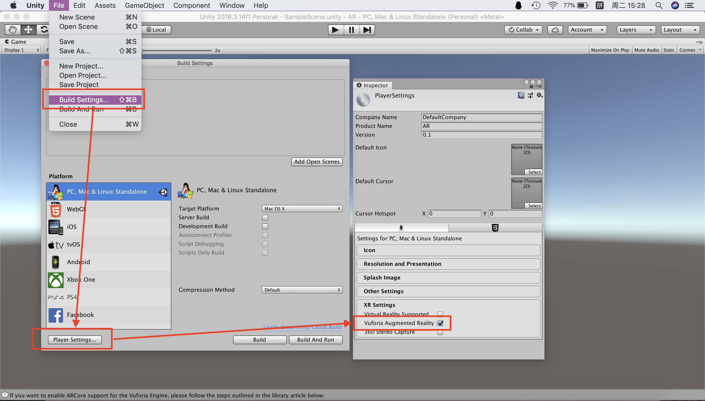
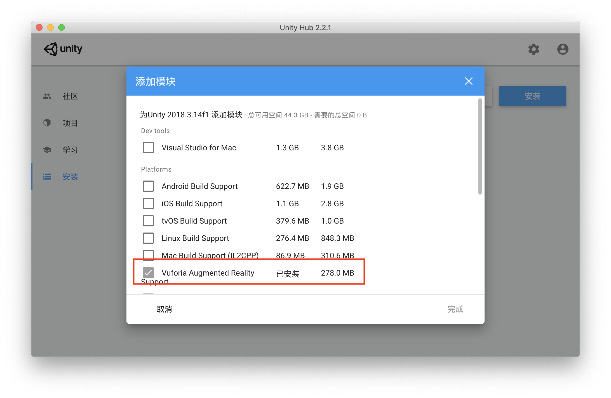
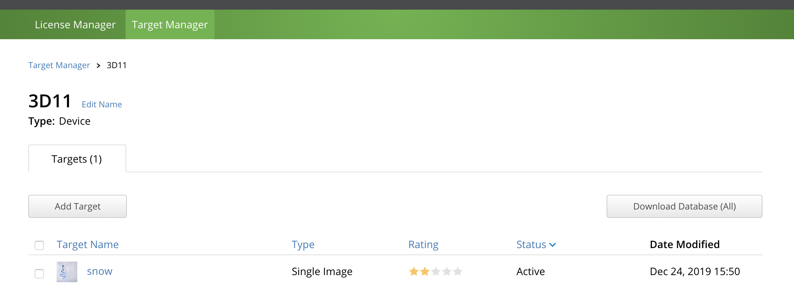
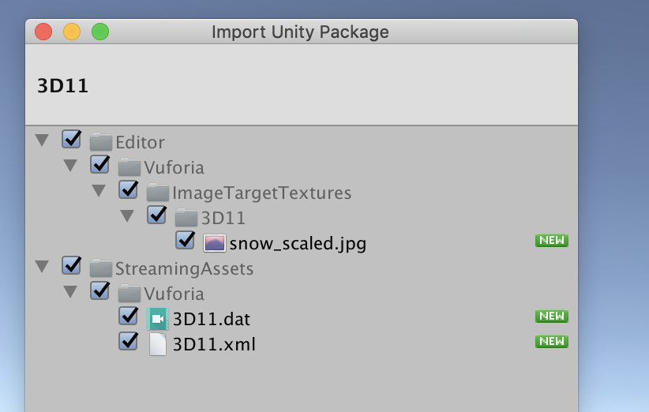
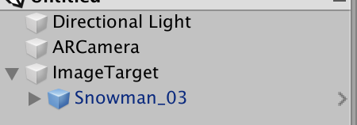
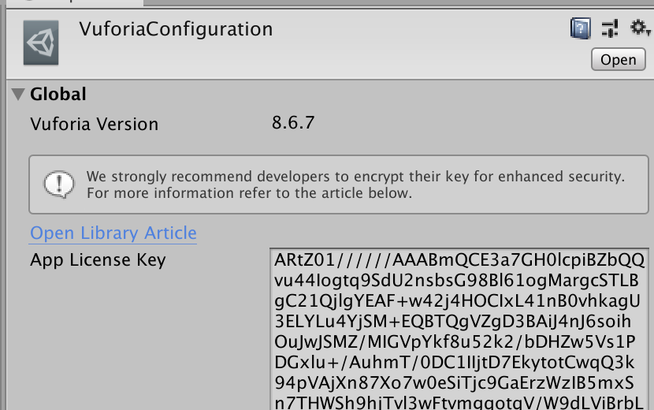
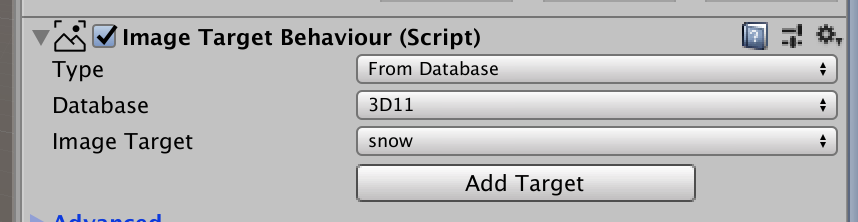
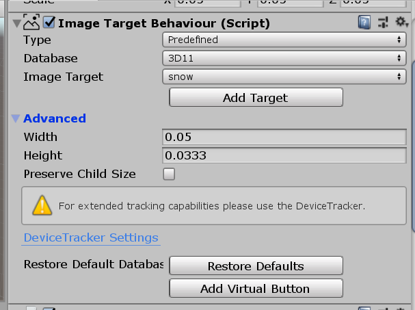
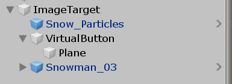

#### 图片识别与建模

##### 环境配置

首先创建一个项目，选择Vuforia Augmented Reality。



如果一开始没有这个选项，就需要下载，因为我是Mac，和Win的配置不太一样。我一开始尝试了很多方法包括在unity官网和vuforia官网下载，都没有成功，最后在unityhub中发现可以直接配置。



Mac系统就算最新版本也会闪退，总之我没有找到好的解决方法，所以借用同学的电脑。

##### 创建模型

按照课程讲义上的方法创建好一个target。



然后下载并在项目中导入它。



##### 识别模型

然后删掉原本的camera，添加ar camera和image target，并给target添加一个子对象，也就是检测到时显示的模型，对他们进行配置。



首先要把lisence生成的密钥复制进arcamera的vuforiaconfuguration。



然后设置imagetarget为导入的数据库里的内容。



此时已经可以识别出图片并在上面出现雪人⛄️


##### 虚拟按钮

我们在image target下添加一个虚拟按钮。



并用一个plane来显示它的位置。



接下来写一个脚本来控制对象的行为，点击虚拟按钮，雪人会转向180度。

```c#
void Start()
    {
        vbs = GetComponentsInChildren<VirtualButtonBehaviour>();
        button.GetComponent<MeshRenderer>().material.color = Color.white;
        for (int i = 0; i < vbs.Length; i++)
        {
            vbs[i].RegisterEventHandler(this);
        }
    }

    public void OnButtonPressed(VirtualButtonBehaviour vb)
    {
        button.GetComponent<MeshRenderer>().material.color = Color.red;
        snow.transform.Rotate(Vector3.up * 180);
    }
   
    public void OnButtonReleased(VirtualButtonBehaviour vb)
    {
        button.GetComponent<MeshRenderer>().material.color = Color.white;
    }
```

[项目仓库](https://github.com/anjahappy/3DGameHomework11)

[演示视频](https://v.qq.com/x/page/l3041pud6d4.html)